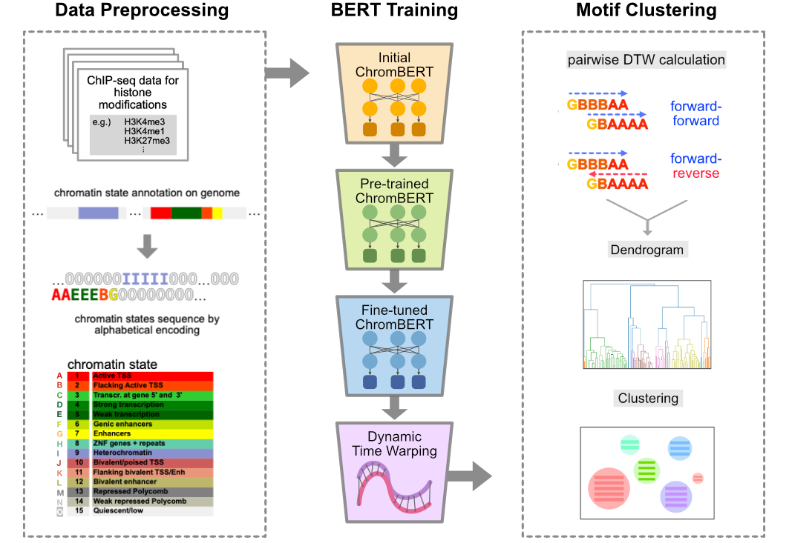

# ChromBERT: Uncovering Chromatin State Motifs in the Human Genome Using a BERT-based Approach


This repository contains the code for '**ChromBERT: Uncovering Chromatin State Motifs in the Human Genome using a BERT-based Approach**'. 
If you utilize our models or code, please reference our paper. We are continuously developing this repo, and welcome any issue reports.

<p align="center">
  
</p>

This package offers the source codes for the ChromBERT model, which draws significant inspiration from [DNABERT](https://doi.org/10.1093/bioinformatics/btab083) 
<sub>(Y. Ji et al., "DNABERT: pre-trained Bidirectional Encoder Representations from Transformers model for DNA-language in genome", Bioinformatics, 2021.)</sub> 
ChromBERT includes pre-trained models for promoter regions (2 kb upstream to 4 kb downstream of TSS) and whole-genome regions, covering both the 15-chromatin state system (127 cell types from the ROADMAP database) and the 18-chromatin state system (1699 cell types from the IHEC database). Fine-tuned models for gene expression classification and regression (15-chromatin state system) are also provided. For downstream analysis, ChromBERT offers a DTW-based motif clustering and visualization tool.

Utility functions for data preprocessing and analysis are available in the `processing/chrombert_utils` directory. A Google Colab tutorial is provided for dataset preparation and curation, which we recommend completing before proceeding to the training stage in the `training/examples` directory.

## Citation 📖

If you use this repository in your research, please cite our paper:

**ChromBERT: Uncovering Chromatin State Motifs in the Human Genome Using a BERT-based Approach**  
Authors: Seohyun Lee, Che Lin, Chien-Yu Chen, and Ryuichiro Nakato

bioRxiv, July 26, 2024.
**DOI:** [10.1101/2024.07.25.605219](https://doi.org/10.1101/2024.07.25.605219)


<br>

## 1. System Requirements and Optimal Configurations 🎯
### Software
- Operating System: Linux (Ubuntu 22.04 LTS recommended)
- Python: 3.11
- PyTorch: 2.6.0 (Check with `conda list | grep torch` to see your installed version)

#### Verified Configurations
We have tested and confirmed that the following configuration works well for running our model:

| Component               | Version / Info                                 |
|-------------------------|------------------------------------------------|
| CUDA Version            | 12.4                                           |
| cuDNN Version           | 9.1.0                                          |
| NVIDIA Driver Version   | 550.78                                         |
| GPU                     | Tested with NVIDIA RTX 6000 Ada Generation     |


### Hardware
- Recommended GPU: NVIDIA RTX 6000 Ada Generation or higher with appropriate CUDA compatibility
- Memory: 251 GB RAM recommended. This recommendation is based on the memory requirements observed during testing, which includes processing large datasets and maintaining efficient model operations. 


<br>

## 2. Installation with Environment Setup 📦
To ensure optimal performance and avoid dependency conflicts, we recommend setting up separate environments for data preprocessing and model training. For each environment, an `environment.yml` file is provided for easy setup using Conda (or [Mamba](https://github.com/mamba-org/mamba) for faster resolution). Follow the instructions below to clone the repository and create the environment.

### 2-1. Clone the ChromBERT repository
To download the source code to your local machine, execute:

```bash
$ git clone https://github.com/caocao0525/ChromBERT
$ cd ChromBERT
```

### 2-2. Setting up the data processing environment
Follow these steps to create and activate an environment for data processing and analysis:

Using Conda:
```bash
$ conda env create -f environment.yml
$ conda activate chrombert # Activate the environment

# Note: The prompt will change to reflect the current environment name, shown as (chrombert)$
(chrombert)$ conda deactivate # Deactivate current environment
```

Or, using Mamba (if installed):
```
$ mamba env create -f environment.yml # Create environment from file
$ mamba activate chrombert
```

The `chrombert_utils` package is essential for data preprocessing and downstream analysis related to Chromatin State Sequences. To install this package, ensure you are operating within the data processing environment by following these steps:

```bash
$ conda activate chrombert
(chrombert)$ cd processing
(chrombert)$ pip install -e .
```

### 2-3. Setting up the training environment
Follow these steps to create and activate an environment specifically for training: 

```bash
$ cd training
$ mamba env create -f environment.yml 
$ conda activate chrombert_training # Activate the environment

# Note: The prompt will change to reflect the current environment name, shown as (chrombert_training)$
(chrombert_training)$ conda deactivate # Deactivate current environment
```
<!--Mamba enhances the setup process by speeding up dependency resolution and package installation compared to Conda.-->

Next, in the `chrombert_training` environment, install the packages for training as follows:

```bash
$ conda activate chrombert_training
(chrombert_training)$ cd training
(chrombert_training)$ pip install -e . --config-settings editable_mode=compat  # for pip ≥ 25.0 compatibility with editable installs
```


<br> 

## 3. Chromatin state data pre-processing 📊

<!--In this tutorial, we presume that users have a `.bed` file of chromatin states labeled numerically according to 15 different chromatin states classes offered by [ROADMAP](https://egg2.wustl.edu/roadmap/web_portal/chr_state_learning.html) (Roadmap Epigenomics Consortium et al., "Integrative analysis of 111 reference human epigenomes," Nature, 2015). -->

We highly recommend using the Colab tutorial for preparing your pretraining and fine-tuning data:  

<p align="center">
  <a href="https://colab.research.google.com/github/caocao0525/ChromBERT/blob/main/colab/ChromBERT_on_Colab.ipynb">
    
  </a>
</p>


## 4. Training ⏳

For pre-training, fine-tuning, and to replicate our results, we recommend users download the `ChromBERT.zip` file from the Zenodo link below:

<p align="center"> 
  <a href="https://doi.org/10.5281/zenodo.15518584">
    
  </a>
</p>


For organized access, please store the downloaded file in an appropriate directory, such as `training/examples/prom/pretrain_data`. 
In this section, we provide procedures for the 4-mer dataset. However, users have the flexibility to change the value of `k` by modifying the line `export KMER=4` in each script to suit their specific requirements.

### 4-1. Pre-training

#### 4-1-1. 15-chromatin state system (ROADMAP data)
The pre-training script is located in the `training/examples/prom/script_pre/` directory. Users can adjust the file names within the script should they alter the directory or the name of the training data files. The model outputs will be saved in the `../pretrain_result/` directory.

```bash
(chrombert_training) $ cd training/examples/prom/script_pre
(chrombert_training) $ bash run_pretrain.sh \
                        --train_file .../pretrain_data \
                        --test_file ../pretrain_data
```

**Optional arguments**:

| Argument            | Description                              | Default value                                    |
|---------------------|------------------------------------------|--------------------------------------------------|
| `--train_file`      | Path to training data file               | `../pretrain_data/pretraining_small.txt`        |
| `--test_file`       | Path to evaluation data file             | Same as training file                            |
| `--max_steps`       | Maximum number of training steps         | `500`                                            |
| `--learning_rate`   | Learning rate for optimizer              | `2e-4`                                           |
| `--mlm_prob`        | Masked Language Modeling probability     | `0.025`                                          |
| `--train_batch`     | Training batch size per GPU              | `5`                                              |
| `--eval_batch`      | Evaluation batch size per GPU            | `3`                                              |


**Note:** The default `pretraining_small.txt` is a quick test dataset extracted from chromosome 1 of cell type E003.

<!--#### 4-1-2. 18-chromatin state system (IHEC data)

Due to the large size of the IHEC pretraining dataset (1699 cell types), the process is divided into two steps:

 1. Splitting the full dataset into smaller shuffled chunks
 2. Running looped pretraining over each chunk

The scripts are located in the `training/examples/prom_ihec/script_pre/` directory. Before running them, make sure to place the pretraining data file (`promoter_ihec_all_4mer_wo_4R.txt`, downloaded from Zenodo) in the `training/examples/prom_ihec/pretrain_data/` directory.

**Step 1: Split the data into shuffled chunks**

Run the following script to split the full dataset into chunks of 100,000 lines each. The shuffled and chunked files will be saved under `../pretrain_data/split_chunks/`.

```bash
(chrombert_training) $ cd training/examples/prom_ihec/script_pre
(chrombert_training) $ bash split_chunk.sh
```
This script shuffles the input file and splits it into evenly sized chunks for sequential training.

**Step 2: Run looped pretraining over the chunks**

Use the provided `pretraining_loop.sh` script to sequentially train on each chunk of the shuffled data.

```bash
(chrombert_training) $ cd training/examples/prom_ihec/script_pre
(chrombert_training) $ bash pretraining_loop.sh
```

The model outputs for each chunk will be saved in the `../pretrain_result/` directory. -->

### 4-2. Fine-tuning

#### 4-2-1. Classification
Following pre-training, the parameters are saved in the `training/examples/prom/pretrain_result/` directory. To replicate our classification results, users should place the files `train.tsv` and `dev.tsv` directly in the `examples/prom/ft_data/classification` directory. This location includes data for classifying promoter regions between genes that are highly expressed (log-transformed RPKM values are greater than 5) and those that are not expressed (RPKM = 0).Note that our `ChromBERT.zip` file offers promoter region fine-tuning data from 57 different cell types under the `promoter_finetune_data` directory. Users are encouraged to properly place the required file.

```bash
(chrombert_training) $ cd training/examples/prom/script_ft
(chrombert_training) $ bash run_4mer_classification_finetune.sh
```

**Optional arguments**:

| Argument         | Description                                | Default                         |
|------------------|--------------------------------------------|---------------------------------|
| `--model_path`   | Path to the pre-trained model               | `../pretrain_result`           |
| `--data_path`    | Path to the fine-tuning dataset             | `../ft_data/classification`    |
| `--output_path`  | Directory to save fine-tuned model          | `../ft_result/classification`  |
| `--epochs`       | Number of training epochs                   | `10.0`                          |
| `--lr`           | Learning rate                               | `2e-5`                          |
| `--batch_size`   | Batch size for both training and evaluation | `32`                            |


#### 4-2-2. Regression
To replicate our regression results, users should place the files `train.tsv` and `dev.tsv`—which contain sequence and log-transformed RPKM value pairs—directly in the `training/examples/prom/ft_data/regression` directory.

```bash
(chrombert_training) $ cd training/examples/prom/script_ft
(chrombert_training) $ bash run_4mer_regression_finetune.sh
```

#### 4-3. Prediction
To obtain an attention matrix for the prediction result, execute the scripts in the following order: First, run `run_4mer_pred.sh` in the `training/examples/prom/script_pred` directory.

```bash
(chrombert_training) $ cd training/examples/prom/script_pred
(chrombert_training) $ bash run_4mer_pred.sh 
```

**Optional arguments**:

| Position | Argument          | Description                                  | Default                      |
|----------|-------------------|----------------------------------------------|------------------------------|
| 1        | `KMER`            | K-mer size used for the tokenizer            | `4`                          |
| 2        | `MODEL_PATH`      | Path to the fine-tuned model                 | `../ft_result/classification` |
| 3        | `DATA_PATH`       | Path to the input data for prediction        | `../ft_data/classification`  |
| 4        | `PREDICTION_PATH` | Directory to save prediction results         | `../predict_result`          |

<br>

## 5. Motif Detection and Clustering 🧬

The identification of chromatin state motifs can be categorized into two phases: Motif Detection and Motif Clustering. During the Motif Detection phase, chromatin state sequences that have high attention scores and are uniquely associated with the class of interest (for example, the promoter region) are identified and organized into a dataframe. Subsequently, these sequences undergo clustering through Dynamic Time Warping (DTW) in the Motif Clustering phase, leading to the identification of the definitive chromatin state motifs.

### 5-1. Motif Detection

```bash
(chrombert) $ cd training/motif/prom
(chrombert) $ bash ./motif_prom.sh 
```

Executing the script as described above allows users to generate a `init_df.csv` file in the `./result` directory. This file includes a comprehensive list of chromatin state sequences. To adjust settings such as the window size, minimum sequence length, and the minimum occurrence threshold, users can modify the script's arguments as demonstrated below:

```bash
(chrombert) $ bash ./motif_prom.sh --window_size 12 --min_len 5 --min_n_motif 2
```

**Optional arguments**:

| Argument           | Description                                         | Default value                     |
|--------------------|-----------------------------------------------------|-----------------------------------|
| `--window_size`    | Sliding window size for motif scanning              | `12`                              |
| `--min_len`        | Minimum length of motifs to report                  | `5`                               |
| `--min_n_motif`    | Minimum number of motif instances required          | `2`                               |
| `--data_path`      | Path to the input data directory                    | `../../examples/prom/ft_data`     |
| `--predict_path`   | Path to the prediction results directory            | `../../examples/prom/predict_result` |
| `--motif_path`     | Directory to save discovered motifs and plots       | `./result`                        |

For further assistance, the `--help` option provides a detailed explanation of all available arguments, their default settings, and an illustrative example of how to use them:

```bash
(chrombert) $ bash ./motif_prom.sh --help
```

### 5-2. Motif Clustering

For motif clustering, we recommend using the "Motif Clustering" section in the Colab tutorial linked below: 

<p align="center">
  <a href="https://colab.research.google.com/github/caocao0525/ChromBERT/blob/main/colab/ChromBERT_on_Colab.ipynb">
    
  </a>
</p>


<br>

<!--First, users can create a matrix to serve as the foundational data structure for motif clustering by executing the following code:

```python
df_sequences=crb.motif_init2df(input_path='path/to/your/init_df.csv')
```

To generate the predicted classes for each motif in the `init_df.csv` file by employing Dynamic Time Warping (DTW) along with agglomerative clustering, execute the code below.
The `categorical` option is a boolean where `True` means that the user considers the distance between each chromatin state equal, while `False` means that the chromatin states A to O are numerically converted to 1 to 15.
The default is False. 

```python
y_pred=crb.motif_init2pred(input_path='path/to/your/init_df.csv',
                           categorical=False,
                           fillna_method='ffill', # Method to fill NaN padding for shorter sequences ('ffill' or 'O')
                           n_clusters=number_of_clusters
                           linkage_method='complete' # Linkage method for agglomerative clustering. See the documentation: https://docs.scipy.org/doc/scipy/reference/generated/scipy.cluster.hierarchy.linkage.html 
                           )
```

*[Optional]* We provide a function to create an dendrogram, which aids in determining the optimal number of clusters for usability.

```python
crb.motif_init2pred_with_dendrogram(input_path='path/to/your/init_df.csv',
                                    categorical=False,
                                    n_cluster=None,
                                    fillna_method='ffill', # Method to fill NaN padding for shorter sequences ('ffill' or 'O')
                                    linkage_method='complete', # Linkage method for agglomerative clustering. See the documentation: https://docs.scipy.org/doc/scipy/reference/generated/scipy.cluster.hierarchy.linkage.html 
                                    threshold=<int>) # To estimate the initial number of cluster. Users can adjust it according to the shape of dendrogram
```
Note that with `n_cluster=None`, the number of clusters is estimated based on the specified threshold.

To obtain the clustered motifs in a DataFrame format, users can execute the following function:

```python
clustered_sequence=crb.motif_init2class(input_path='path/to/your/init_df.csv', n_clusters=number_of_clusters)
```

For visualization purposes, users can understand the overall characteristics of clustered motifs by using the following function:

```python
crb.motif_init2cluster_vis(input_path='path/to/your/init_df.csv',
                           categorical=False,
                           n_clusters=number_of_clusters,
                           fillna_method='ffill', # Method to fill NaN padding for shorter sequences ('ffill' or 'O')
                           linkage_method='complete', # Linkage method for agglomerative clustering. See the documentation: https://docs.scipy.org/doc/scipy/reference/generated/scipy.cluster.hierarchy.linkage.html
                           random_state=<int>, # Random seed for reproducibility of the generated figure
                           font_scale=0.04, # Adjust the text size balance
                           font_v_scale=9, # Adjust the text vertical size ratio
                           fig_w=12, # Figure width
                           fig_h=8, # Figure height
                           node_size=1000, # Size of bubbles
                           node_dist=0.05   # Distance between nodes
                           )
```
Note that the generated image file is saved at the same directory with a name `cluster_result.png`


*[Optional]* We provide an optional feature that facilitates the generation of a UMAP, designed to help users intuitively grasp the essential features of clustered motifs. 
It's important to note that users have the flexibility to configure the `n_neighbors` and `min_dist` parameters to suit their specific needs.

```python
crb.motif_init2umap(input_path='path/to/your/init_df.csv',
                    categorical=False,
                    n_clusters=number_of_clusters,
                    fillna_method='ffill', # Method to fill NaN padding for shorter sequences ('ffill' or 'O')
                    linkage_method='complete', # Linkage method for agglomerative clustering. See the documentation: https://docs.scipy.org/doc/scipy/reference/generated/scipy.cluster.hierarchy.linkage.html
                    n_neighbors=size_you_want,
                    min_dist=minimum_distance_you_want,
                    random_state=<int>) # Random seed for reproducibility of the generated figure

```
<br> -->

<!--## Contributing

We welcome contributions to [Project Name]. If you're interested in helping, please take a look at our [Contributing Guidelines](CONTRIBUTING.md) for more information on how to get started.-->

<br>

## License

This project is licensed under the Apache License, Version 2.0. See the [LICENSE](LICENSE) file for details.


<br>

<!-- ## Acknowledgements

Thanks to [Contributor Name] for [contribution], and to everyone who has submitted issues or pull requests.

<br>

## Contact

For any questions or feedback, feel free to [open an issue](link-to-issues) or contact me directly at [email@example.com](mailto:email@example.com). -->

---

Thank you for checking out **ChromBERT**. If you found this project useful, please consider starring it on GitHub to help it gain more visibility.


<br>


